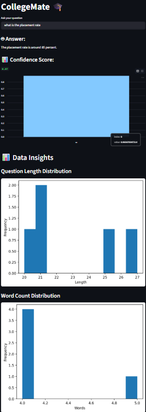

# CollegeMate 🎓🤖

## Overview

CollegeMate is a semantic NLP chatbot designed to answer common college-related queries. It uses sentence embeddings and cosine similarity to retrieve the most relevant answer from a predefined FAQ dataset.

## Features

* Semantic question matching
* NLP-based response retrieval
* Interactive Streamlit interface
* Data analysis and visualization
* FAQ dataset integration

## Technologies Used

* Python
* Streamlit
* Pandas
* NumPy
* NLP techniques
* Cosine Similarity

## Dataset

The chatbot uses a college FAQ dataset containing common student queries and their corresponding answers.

## Project Workflow

1. User enters a question.
2. The question is converted into embeddings.
3. Cosine similarity is calculated against stored questions.
4. The most relevant answer is returned.
5. Data insights are visualized through charts.

## Demo

## Future Improvements

* Larger FAQ database
* Advanced transformer-based models
* Context-aware conversations
* Multi-language support

## Author

Anu Priya
B.Tech CSE Student

